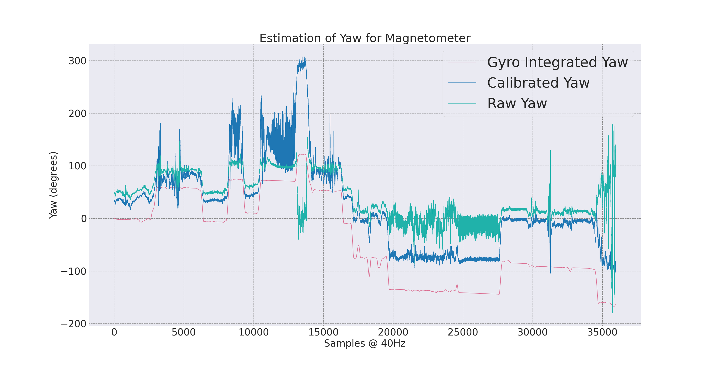
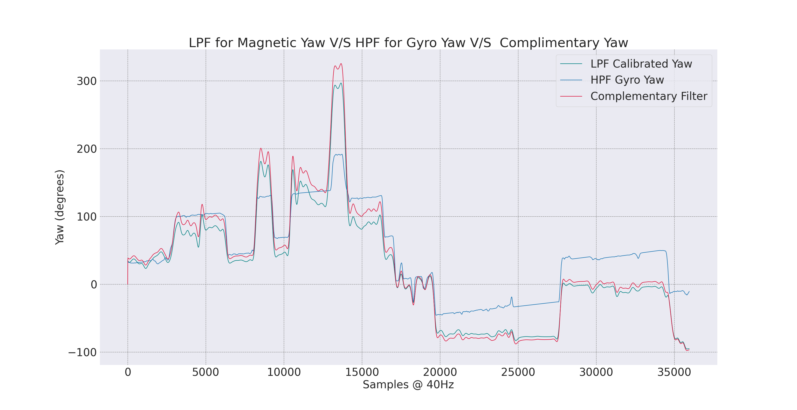
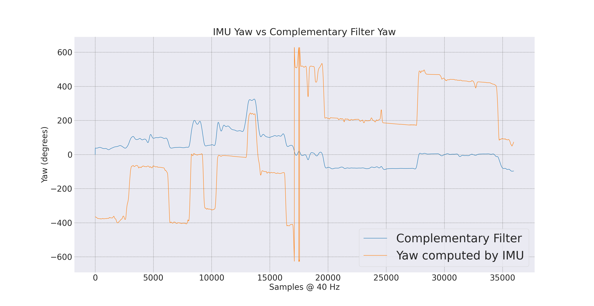
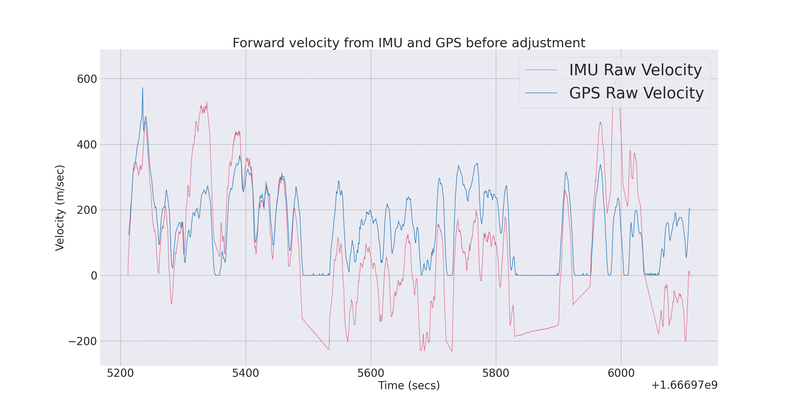
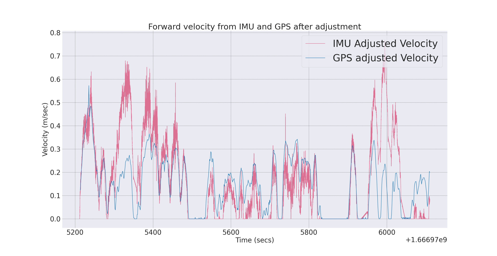
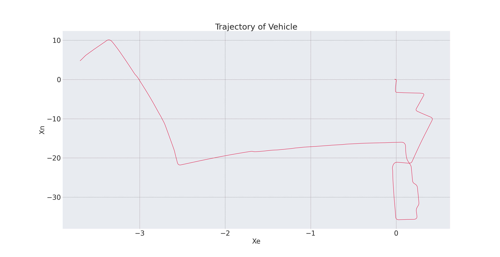
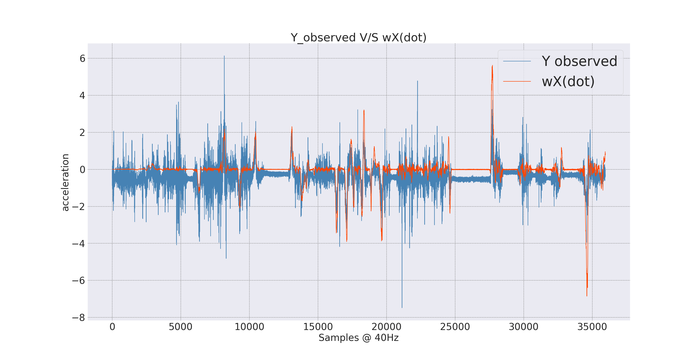

# 1. Magnetometer Hard and Soft Iron Calibration

A magnetometer is a sensor used to measure the strength and direction of the local magnetic field surrounding a system. This measurement is compared to Earth’s magnetic field model to determine the heading with respect to magnetic North. In real-world applications, the measured field is a combination of Earth’s field and nearby magnetic disturbances. To obtain an accurate heading, these disturbances must be mitigated using Hard and Soft Iron (HSI) calibration.

For the driving data rosbag file, please visit the following link:  
- [Driving Data Rosbag File](https://northeastern-my.sharepoint.com/:f:/g/personal/singh_risha_northeastern_edu/EiQZj8icjChFuHfHlOTiVawBeNLQ7QiOJDE8PzJJsHmVUQ?email=tiwari.ks%40northeastern.edu&e=qD9CTR)

---

## 1.1 Hard and Soft Iron Distortions

Magnetic measurements can suffer from two types of distortions:

1. **Hard Iron Distortions:**  
   These are caused by nearby objects that generate a magnetic field (e.g., a speaker or magnetized iron). If attached to the same reference frame as the sensor, they introduce a permanent bias.

2. **Soft Iron Distortions:**  
   These are deflections or alterations of the existing magnetic field. Soft iron distortions stretch or warp the field depending on the sensor’s orientation relative to the field, commonly caused by metals like nickel and iron. Typically, hard iron distortions contribute a larger error than soft iron.

---

## 1.2 Visualizing Hard and Soft Iron Distortions

1. **Case 1 – No Distortions:**  
   The measurements form a circle centered at \( (0, 0) \) with a radius equal to the magnetic field magnitude.

2. **Case 2 – Hard Iron Distortions:**  
   A permanent bias shifts the center of the circle. For example, if \( X = 200 \) and \( Y = 100 \), it indicates a 200 mGauss bias along the X-axis and 100 mGauss along the Y-axis.

3. **Case 3 – Hard and Soft Iron Distortions:**  
   Hard iron only shifts the center. In contrast, soft iron distorts the circle into an ellipse. If the ellipse’s major and minor axes are rotated relative to the sensor’s frame, the distortion is caused by soft iron effects.

---

## 1.3 Hard-Iron Calibration

Compensation for hard-iron distortion involves calculating the offsets for the X and Y axes and subtracting these from the measured data. The offsets are calculated as:

$$
\alpha = \frac{X_{\text{max}} + X_{\text{min}}}{2}, \quad \beta = \frac{Y_{\text{max}} + Y_{\text{min}}}{2},
$$

where:
$$
- \(X_{\text{max}}\) is the maximum X value,  
- \(X_{\text{min}}\) is the minimum X value,  
- \(Y_{\text{max}}\) is the maximum Y value, and  
- \(Y_{\text{min}}\) is the minimum Y value.
$$
Subtracting these offsets from the raw magnetometer data largely eliminates the hard-iron distortion.

---

## 1.4 Soft-Iron Calibration

After the hard-iron calibration, the ellipse’s center is at \( (0,0) \), but it may be rotated by an angle \(\theta\) relative to the X-axis. The soft-iron calibration involves:

1. **Compute the magnitude of the calibrated data:**

   $$
   r = \sqrt{X_1^2 + Y_1^2}.
   $$

2. **Determine the rotation angle \(\theta\):**

   $$
   \theta = \arcsin\left(\frac{Y_1}{r}\right).
   $$

3. **Construct the rotation matrix \( R \):**

   $$
   R = \begin{bmatrix}
   \cos\theta & \sin\theta \\
   -\sin\theta & \cos\theta
   \end{bmatrix}.
   $$

4. **Rotate the magnetometer vector:**

   $$
   v_1 = R v.
   $$

5. **Determine the scale factor \(\sigma\):**

   $$
   \sigma = \frac{q}{r},
   $$

   where \(q\) corresponds to the length of the minor axis of the ellipse.

After the rotation, each magnetometer X value is divided by \(\sigma\) to convert the ellipse into an approximate circle.

---

# 2. Estimation of Yaw Angle

## 2.1 Magnetometer Yaw Estimate Before and After Calibration

After calibrating the hard and soft iron distortions, the yaw angle is computed from the magnetometer data. This yaw can also be derived from integrating gyroscope data. Typically:

- The yaw computed from the gyroscope is smoother with fewer peaks.
- The magnetometer-derived yaw is less smooth due to higher sensitivity to disturbances.

## 2.3 Gyroscope Yaw Estimate and Complementary Filter Yaw Estimate

- A **Low-Pass Filter (LPF)** is applied to magnetometer data to reduce high-frequency noise and drift.
- A **High-Pass Filter (HPF)** is applied to gyroscope data to minimize low-frequency drift.

---

# 3. Estimation of Forward Velocity

Forward velocity can be estimated in two ways:

1. **Integration of Accelerometer Data:**  
   Use the X component of the linear acceleration (aligned with the vehicle’s front). The Y component is ignored since the vehicle does not skid sideways.

2. **GPS-Based Calculation:**  
   Compute the hypotenuse of the easting (X) and northing (Y) components of the GPS data and differentiate with respect to time.

---

# 4. Dead Reckoning with IMU

Dead reckoning calculates the current position of a moving object from a previously determined position. With an IMU, this is achieved by multiplying the estimated forward velocity with the yaw angle.

## 4.1 Obtain Velocity by Integrating Acceleration

The acceleration as sensed in the vehicle frame is given by:

$$
\ddot{x}_{\text{obs}} = \ddot{X} - \omega \dot{Y} - \omega^2 x_c,
$$

which, under certain assumptions, can simplify to:

$$
\ddot{x}_{\text{obs}} = \ddot{X}.
$$

Similarly, for the Y direction:

$$
\ddot{y}_{\text{obs}} = \ddot{Y} + \omega \dot{X} + \dot{\omega} \, x_c.
$$

Here:
- \(\ddot{X}\) and \(\ddot{Y}\) are the accelerations in the vehicle's X and Y directions,
- \(\omega\) is the angular velocity (around the Z-axis),
- \(x_c\) is the sensor’s displacement from the vehicle’s center of mass.

## 4.2 Estimation of \( x_c \)

The inertial sensor is displaced from the center of mass (CM) by a vector \( r = (x_c, 0, 0) \). The velocity \( v \) measured by the sensor is related to the actual linear velocity \( V \) by:

$$
v = V + \omega \times r,
$$

and its acceleration by:

$$
\ddot{x} = \dot{v} + \omega \times v = \ddot{X} + \dot{\omega} \times r + \omega \times \dot{X} + \omega \times (\omega \times r).
$$

An estimate for \( x_c \) can be derived from:

$$
x_c = \frac{V - v}{\omega}.
$$

This relationship implies that \( x_c \) and \(\omega\) are inversely proportional; small \(\omega\) results in larger \( x_c \) and vice versa. When the car travels in a straight line at constant speed (with \( V \) minimal), this equation yields a more reasonable estimate.

---

# Navigation_Stack_using-IMU-And-GPS

This repository covers the calibration of a magnetometer (compensating for hard and soft iron distortions), estimation of yaw angles, computation of forward velocity, and dead reckoning using an IMU for navigation purposes.
