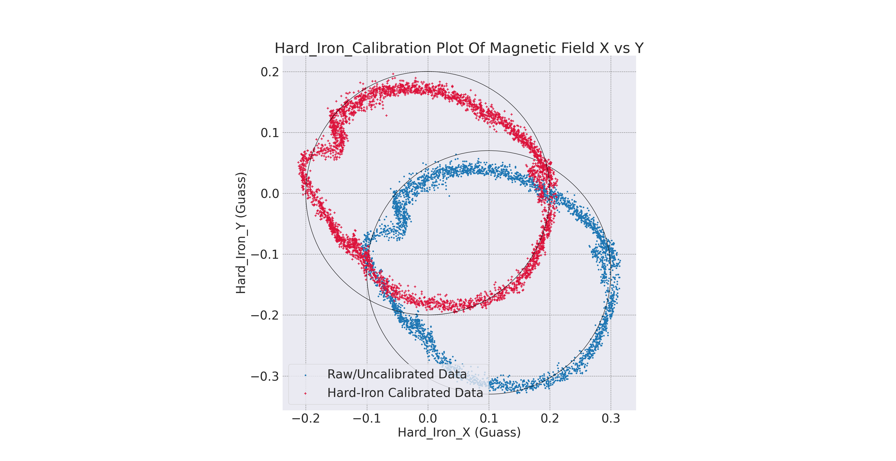
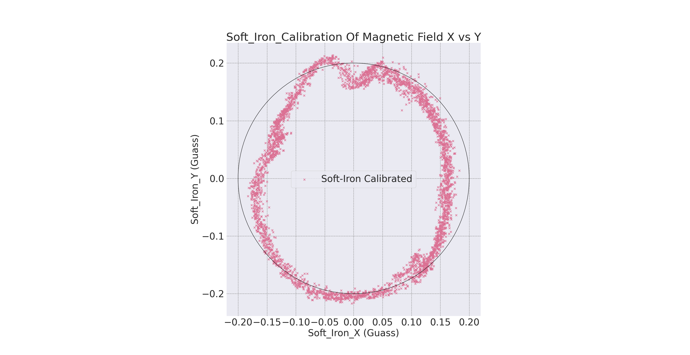
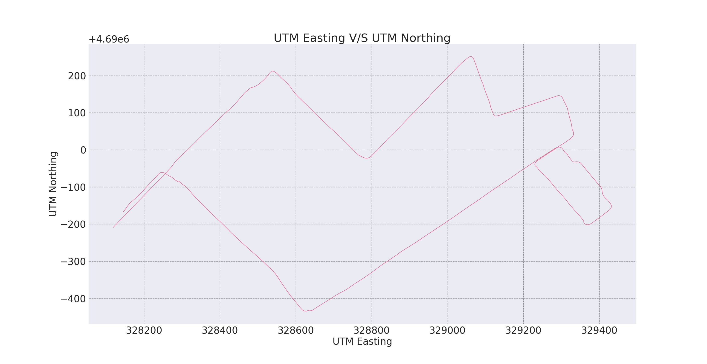

# 1. Magnetometer Hard and Soft Iron Calibration
A magnetometer is a sensor used to measure the strength and direction of the local magnetic field surrounding a system. This magnetic field measurement can then be compared to models of Earth’s magnetic field to determine the heading of a system with respect to magnetic North. However, in most real-world applications, the magnetic field measured will be a combinationof both Earth’s magnetic field as well as magnetic fields created by nearby objects, commonly referred to as magnetic disturbances. In order to obtain an accurate heading estimate, the impact of nearby magnetic disturbances must be mitigated. Internal magnetic disturbances that are non-time varying can be accounted for using a hard and soft iron (HSI) calibration.

For the driving data rosbag file you can visit the following link:
- https://northeastern-my.sharepoint.com/:f:/g/personal/singh_risha_northeastern_edu/EiQZj8icjChFuHfHlOTiVawBeNLQ7QiOJDE8PzJJsHmVUQ?email=tiwari.ks%40northeastern.edu&e=qD9CTR

# 1.1 Hard and Soft Iron Distortions
Magnetic measurements are subjected to distortion. These distortions are considered to fall in one of two categories:
1. Hard iron distortions: They are created by objects that produce a magnetic field. A speaker or piece of magnetized iron for example will cause a hard iron distortion. If the piece of magnetic material is physically attached to the same reference frame as the sensor, then this type of hard iron distortion will cause a permanent bias in the sensor output.

2. Soft iron distortions: They are considered deflections or alterations in the existing magnetic field. These distortions will stretch or distort the magnetic field depending upon which direction the field acts relative to the sensor. This type of distortion is commonly caused by metals such as nickel and iron. In most cases hard iron distortions will have a much larger contribution to the total uncorrected error than soft iron.

# 1.2 Visualizing Hard and Soft Iron Distortions
1. Case 1- No Distortions: In the event that there are no hard or soft iron distortions present, the measurements should form a circle centered at X=0, Y=0. The radius of the circle equals the magnitude of the magnetic field.
2. Case 2 - Hard Iron Distortions: Hard iron distortions will cause a permanent bias to be present in the magnetic measurements, which leads to a shift in the center of the circle. Suppose X=200 and Y=100, from this it can be concluded that there is 200 mGauss hard iron bias in the X-axis and 100 mGauss hard iron bias in the Y-axis.
3. Case 3 - Hard and Soft Iron Distortions: Hard iron distortions will only shift the center of the circle away from the origin, they will not distort the shape of the circle in any way. Soft iron distortions, on the other hand, distort and warp the existing magnetic fields. When plotting the magnetic output, soft iron distortions are easy to recognize as they will distort the circular output into an elliptical shape. Every ellipse has a major and minor axis if the major and minor axis aligned to some degrees from the body frame then it is caused by the soft iron distortions.

# 1.3 Hard-Iron Calibration
Compensating for hard-iron distortion is accomplished by determining the x and y offsets and then applying these constants directly to the data.

```
					where,  α is X axis offset
						β is Y axis offset
α = (Xmax + Xmin)/2				Xmax is Maximum X value
β = (Ymax + Ymin)/2				Xmin is Minimum X value
						Y max is Maximum Y value
						Y min is Minimum Y value
These offsets are then subtracted from the raw x and y magnetometer data, thus largely eliminating the hard-iron distortion. 
```
# 1.4 Soft-Iron Calibration
After hard-iron calibration, the origin of the ellipse is at (0, 0), and is exhibiting a rotation of θ degrees from the X axis.

```
r = sqrt{X1^2 + Y1^2}
θ = arcsin(Y 1/r)
                    
R = [ cosθ sinθ]      
    [−sinθ cosθ]
    
v1 = Rv
σ = q/r           
```
One method of identifying ”r” is to calculate the magnitude of each data point and then identify the maximum of these computed values. The coordinates of this value will correspond with the major axis. Similarly, the minimum value will correspond to the minor axis, ”q”. Once θ has been identified, the rotation matrix ”R” given is applied to the vector of magnetometer x and y values. After the rotation, the major axis of the ellipse will be aligned with the reference frame X axis and the minor axis will be aligned with the Y axis. Following the rotation, we can now properly scale the major axis such that the ellipse is converted to an approximate circle. The scale factor σ, is determined, and is the ratio of the length of the major axis to that of the minor axis. Each magnetometer x value is then divided by this scale factor to produce the desired circle.


# 2. Estimation of Yaw Angle
# 2.1 Magnetometer Yaw Estimate before and after calibration
Yaw angle is found after the calibration of hard and soft iron of the magnetometer. It can also be derived from integrating gyroscope data.
Both calculated yaw closely matches the form of the yaw angle internally calculated in the IMU. The yaw calculated from the gyroscope data is relatively smoother and less sensitive (fewer peaks) compared to the IMU yaw, while the yaw derived from the magnetometer data is relatively less smooth.


# 2.3 Gyroscope Yaw Estimate and Complementary Filter Yaw Estimate
1. A LPF is used on the magnetometer data to keep its steady low drift and clip-off any high frequency noise.
2. A HPF is used on the gyro data as the gyroscope data tends to drift over time. So to keep high frequency measurements and clip-off the bias from low frequency drift being integrated a HPF is used.


# 3. Estimation of Forward Velocity
Velocity can be found by taking the integral of acceleration and by finding the instantaneous velocity of each point of GPS data.
To track the velocity or speed of our vehicle we perform integration on accelerometer data. Here we are using only the X component of the Linear acceleration of the accelerometer, which is mounted as the direction pointing straight out the front of the vehicle.
In this experiment we don’t consider Y component linear acceleration because the car is not skidding in a sideways direction.
Forward velocity can also be calculated by taking the hypotenuse of the X and Y components (easting and northing) of our GPS position data and taking the gradient with respect to time.


# 4. Dead Reckoning with IMU
Dead Reckoning is process of calculating current position of a moving object from knowledge of its previously determined position. Dead reckoning is the only navigation choice, especially in the absence of landmarks of known position. Dead reckoning using IMU can be done by multiplying our estimated forward velocity by yaw angle.


# 4.1 Obtain Velocity by Integrating Acceleration
Simplify the equations to get acceleration measured by the inertial sensor (i.e. its acceleration as sensed in the vehicle frame) is:
```
ẍ obs = Ẍ − ωẎ − ω^2 x_c
ẍ obs = Ẍ 
```

Here, all the quantities in these equations are evaluated in the vehicle frame. We can integrate Ẍ to find the velocity. Similarly,
```
ÿ obs = Ÿ + ωẊ + ω̇x_c
```
can be simplified to ÿ obs = ω Ẋ is the velocity calculated. And the ω is the z-axis angular velocity from the gyroscope. We assume that the Ẏ = 0 (that is, the vehicle is not skidding sideways) and ignore the offset by setting x c = 0 (meaning that the IMU is on the center of mass of the vehicle, i.e. the point
about which the car rotates).


# 4.2 Estimation of x_c
The position and velocity of the center-of-mass (CM) of the vehicle is shown by R and V, respectively. The inertial sensor is displaced from the CM by r = (x_c , 0, 0) note that this vector is constant in the vehicle frame and assumes that the displacement of the IMU sensor is only along the x-axis. The velocity of the inertial sensor is:
```
			where,
v = V + ω × r		ω is the is the z-axis angular velocity from the gyroscope
			r = (x c , 0, 0)
			V is actual linear velocity
			v stands for measured linear velocity
```
And its corresponding acceleration is:
```
ẍ = v̇ + ω × v = Ẍ + ω̇ × r + ω × Ẋ + ω × (ω × r)
```
Then the range of possible x_c values were found using the equation:
```
x_c = (V − v)/ω
```
Using the above equation we come to know that x_c and ω are inversely proportional, which means, If we take small values of ω it will give large value of x_c and vice versa.
This method may isolate the radius of rotation of the car making the turn. And, when the car was driving in a straight line at a constant speed V was set as the minimum velocity, which would return a range of more reasonable estimates.



# Navigation_Stack_using-IMU-And-GPS
